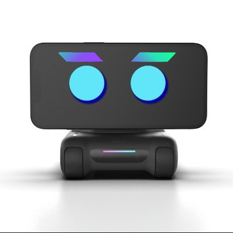
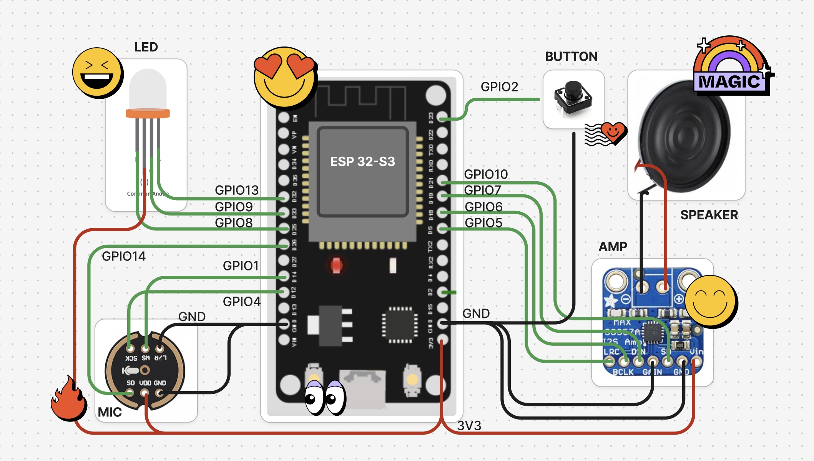
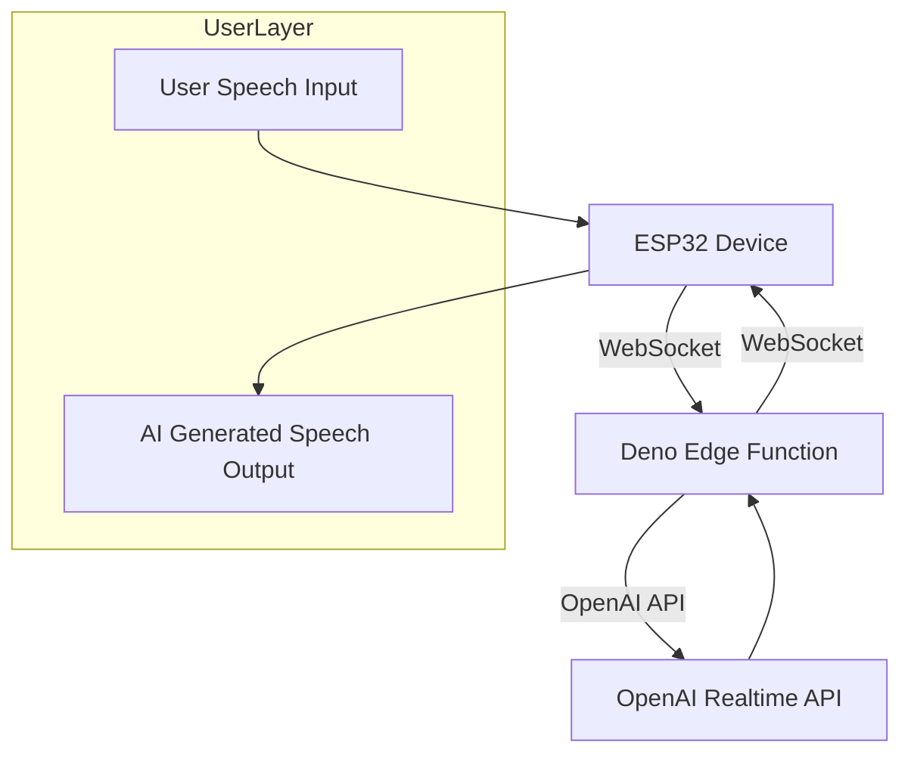
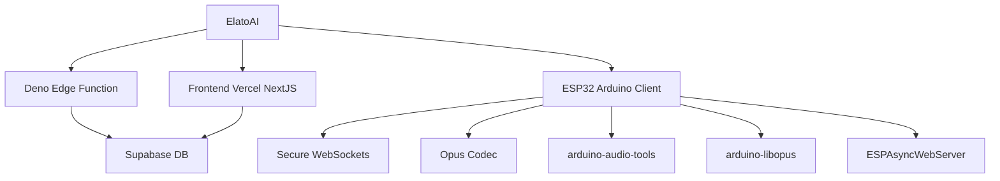

# 🤖 SolmateAI Smartphone Desktop Robot 

Your phone need A Solmate.

The Solmate Smartphone Desktop Robot brings your phone to life with ChatGPT integration. This quirky cyber-companion interacts with you, captures moments, and enhances productivity, turning your desk into a fun, intelligent workspace.

<div align="center">


[](LICENSE)


</div>

## 📽️ Demo Video

<div align="center">
    
  </a>
<h3>


</h3>

</div>

## ⚙️ Hardware Design




## 🚀 Quick Start

1. **Set up your NextJS Frontend**


From the `frontend-nextjs` directory, run the following commands. (**Login creds:** Email: `admin@elatoai.com`, Password: `admin`)
```bash
cd frontend-nextjs
npm install
cp .env.example .env.local

# In .env.local, set your environment variables 
# NEXT_PUBLIC_SUPABASE_ANON_KEY=<your-supabase-anon-key>
# OPENAI_API_KEY=<your-openai-api-key>

# Run the development server
npm run dev
```

2. **Start the Deno server**


```bash
# Navigate to the server directory
cd server-deno
cp .env.example .env

# In .env, set your environment variables 
# SUPABASE_KEY=<your-supabase-anon-key>
# OPENAI_API_KEY=<your-openai-api-key>

# Run the server at port 8000
deno run -A --env-file=.env main.ts
```

3. **Setup the ESP32 Device firmware**

In `Config.cpp` set `ws_server` and `backend_server` to your local IP address. Run `ifconfig` in your console and find `en0` -> `inet` -> `192.168.1.100` (it may be different for your Wifi network). This tells the ESP32 device to connect to your NextJS frontend and Deno server running on your local machine. All services should be on the same Wifi network.

4. **Setup the ESP32 Device Wifi**

Build and upload the firmware to your ESP32 device. The ESP32 should open an `ELATO-DEVICE` captive portal to connect to Wifi. Connect to it and go to `http://192.168.4.1` to configure the device wifi.

5. **Once your Wifi credentials are configured, turn the device off and on again and it should connect to your Wifi and your server.**

6. **Now you can talk to your AI Solmate!**

   graph TD
    A[Voice Input] --> B{Command Type}
    B -->|Conversation| C[GPT-4 Processing]
    B -->|Control| D[Motor Commands]
    C --> E[Text-to-Speech]
    D --> F[Servo Movement]

## 🌟 Features

1. **Work with ChatGPT**: Seamless integration with GPT-4 Turbo API for natural conversations and task execution  
2. **LOOI Free APP**: Cross-platform control app (iOS/Android/Web) with 50+ preset action routines  
3. **Alignment Magnet**: Precision docking system with neodymium magnets (±0.5mm positioning accuracy)  
4. **Front Touch Sensor**: Capacitive touch interface with haptic feedback (10ms response time)  
5. **RGB LED Bar**: Programmable 16-zone light strip supporting 16M color combinations  
6. **LED Headlights**: Adaptive illumination system (1-200 lux auto-adjustment) with obstacle highlighting  
7. **Obstacle Sensors**: 360° TOF+IR hybrid detection (2cm-2m range)  
8. **Wireless Charging Coil**: Qi 1.3 standard (85% efficiency) with foreign object detection  
9. **Side Touch Sensor**: Multi-gesture recognition (swipe/tap/hold) with pressure sensitivity  
10. **USB-C Port**: 3.1 Gen2 interface supporting data/power/accessories (10Gbps/100W PD)  
11. **Cliff Sensors**: Quad IR array for 15cm+ drop prevention with auto-braking  
12. **ToF Sensor**: Time-of-Flight depth sensing (940nm VCSEL) for precise object ranging  
13. **Modular Expansion**: Magnetic accessory ports with I2C/SPI/UART interfaces  
14. **Voice Localization**: 6-mic array with beamforming technology (±5° direction accuracy)  
15. **Auto-Return Charging**: Smart pathfinding to docking station (95% success rate in complex environments)  
16. **Multi-Robot Sync**: Mesh networking support for coordinated swarm operations  
17. **Night Vision Mode**: Low-light optimization with IR cut filter switching  
18. **Emotion Engine**: AI-driven personality expressions through light/voice/motion combinations  
19. **Security System**: AES-256 encrypted communications with biometric voice ID  
20. **Developer Mode**: ROS 2 Humble integration with full sensor data streaming

## 🌟 High-Level Flowchart


## 🌟 Project Structure



